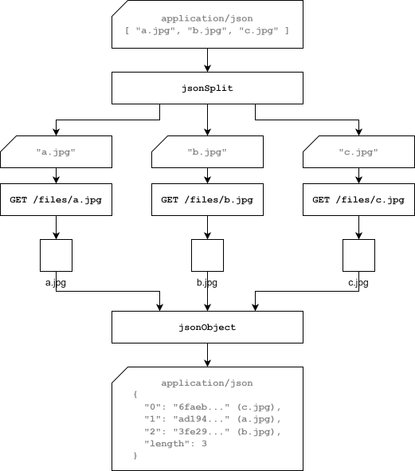

# Pipeline DSL

The philosophy of Restspace is to create reusable functional elements which are tiny webservices on their own urls. These functional elements need a means of composing them into more complex elements. Pipelines fulfil this role. Because they just work with urls as functional elements, this means they can also compose any web service on the internet, making them and incredibly powerful compositional tool.

Pipelines follow the ‘[pipes and filters](https://en.wikipedia.org/wiki/Pipeline_(software))’ philosophy of Unix / Linux. In Unix you have a collection of “[small sharp tools](https://www.brandur.org/small-sharp-tools)” i.e. small single purpose functional units which operate on a standard input and create a standard output, both of which are text streams. This allows these units to be chained together.

Restspace pipelines are a web analogue of this. Instead of standard input and standard output, we have an HTTP request and an HTTP response. There are actually slight differences between an HTTP request and response in terms of allowed headers etc, but it’s quite easy to convert a response into a request to send to the next service component in the chain.

## Simple Pipelines

Here’s a simple example pipeline to demonstrate this idea:

```json
[
  "GET /json/somepagedata",
  "/templates/pagetemplate.html"
]
```

A pipeline is defined in JSON, it’s always an array like this one, each item representing a successive step in the pipeline.

A string in this array can define an HTTP request. The basic syntax of this is a [Request Spec](https://www.notion.so/Request-Spec-5af270c70af2499ab70003ec9ab0a662?pvs=21), although there are some other optional elements that can be added in the context of a pipeline.

What this pipeline does is to fetch JSON data from a url and then to POST that data to a template service which transforms it into an HTML page.

Note that the default method where none is given is ‘POST’.

## Pipelines with Transforms

You can have pipeline steps which transform data using the [Transform DSL](https://www.notion.so/Transform-DSL-440d94dc412c428c867c652a7c4e812a?pvs=21). Transforms unlike normal pipeline steps, are JSON objects - if you see a JSON object in a pipeline you know it’s a transform.  Here’s an example:

```json
[
  {
	  "$": [
		  "literal()",
		  {
			  "heading": "The Heading",
			  "body": "Here's some body text"
		  }
		 ]
  },
  "/templates/pagetemplate.html"
]
```

The idea here is that the transform returns a constant JSON literal (the literal function saves having to double quote literal text which can be confusing). This is then set to the template like in the previous pipeline.

## Path Patterns

HTTP requests in a pipeline can use [path patterns](https://www.notion.so/Path-Pattern-9ea2dc091c3949489c6c540ebea0352e?pvs=21) to map in parts of the path of the original request to the pipeline.

```json
[
  "POST /json/records/$*",
  "/sendemail"
]
```

In this example, let’s say the pipeline is in a Pipeline Service at `/email-record`. If you were to make a request to `/email-record/mail-message` , the POST would be made to `/json/records/mail-message` , with the body of the original request, which would save the record. Then the message would be sent to the `/sendemail` email service which sends it as an email.

## Conditionals

HTTP requests can be conditional, for instance

```json
[
	"if (isJson) PUT /store/data",
	"if (!isJson) PUT /store/files"
]
```

This pipeline will take the body of the incoming request and PUT it in the data store `/store/data` if it’s JSON or else PUT it in the file store `/store/files` if it’s anything else.

Generally a conditional looks like:

```json
if (<expression>) <request>
```

The expression is a test on aspects of the current request. This uses the same subset of Javascript as [supported in Transform DSL](https://www.notion.so/Transform-DSL-440d94dc412c428c867c652a7c4e812a?pvs=21). The following values describing the current request are available for use in the expression:

| name | the name of the message |
| --- | --- |
| mime | the Content-Type (mime type) of the message |
| isJson | the mime is a JSON type mime |
| isText | the mime is a text type mime |
| isBinary | the mime is neither text nor JSON |
| isManage | the request has the header `X-Restspace-Request-Mode` set to `manage` |
| status | the status code of the message |
| ok | if the message succeeded (0 or 200 status) |
| method | the method of the original request |
| subpath | for a pipeline which handles calls to all its subpaths, the subpath as an array of path elements |
| isDirectory | the request is for a directory (url ends in `/`) |
| header(key) | the header value whose key is given |
| body() | the JSON conversion of the message body, given that the message does not have a stream body. You can ensure this by processing the message with `/lib/destream` before this test. |
| query() | an object representing the query fields of the message, the key being the query argument key, and the value being the query argument value. |

Also any pipeline variables are available.

## Parallelism

Initially a single message comes into the top of a pipeline and progresses through the steps. Certain kinds of steps (*splitters*) however can convert this single message to multiple messages which all flow down the pipeline simultaneously, each message flowing through the steps as fast as possible without waiting for the others. Other kinds of steps (*joiners*) can collect all these messages, waiting for them all to arrive, and combining them into a single message.

```json
[
	"jsonSplit",
	"GET /files/${}",
	"jsonObject"
]
```

The parallelism works like this:



- A POST request is sent to this pipeline with the JSON body [ “a.jpg”, “b.jpg”, “c.jpg” ]
- `jsonSplit` takes a JSON list or object body and for each list item or property value, creates a new request, all of which are sent in parallel down the rest of the pipeline. It sets the `name` property of each request to the list position index or property key.
- `GET /files/${}` does a GET request inserting the whole body data in place of the `${}`. This is done in parallel for every parallel request.
- `jsonObject` streams a JSON object message which takes the body of each parallel request as it reaches this point in the pipeline and emits it as part of a JSON object whose key is the `name` of the request. For a list it will append a `length` property once all the parallel requests have completed. We can see the pipeline does a [Request Type Conversion](https://www.notion.so/Request-Type-Conversions-131e0642392c80699e0df3e59569bf38?pvs=21) from binary jpg to a base 64 string here.

The current Splitter/Joiner pairs are:

| jsonSplit | jsonObject | Converts the request body to a JSON format, then splits a list into list items named with the item’s index, and an object into property values named with the property key. Handles ND-JSON as well by splitting at line ending and naming each message with a line number from 0. Joins by converting message bodies to JSON then creating a single message whose body is an object where each property has the key of the incoming message name and the value is the message’s body. The single message’s body is a stream and the key/values are sent into the stream as soon as they are received. |
| --- | --- | --- |
| unzip | zip | The request’s body must be a zip file. This splits it into one message for each file in the zip file, the message’s url has the path to the file inside the zip file appended, and the message’s name is set to the zip file path of the file. Messages are sent down the pipeline as soon as they are created. Joining works by taking each message as they arrive and streaming out to the zip file, using the name of the message as the path within the zip file, or if no name, the final url segment. |
| multipartSplitter | multipartJoiner | These are not yet implemented. The splitter takes a message body which is multipart, then emits all the data fields as a message with a JSON object where properties are the field names and the values are the field values. It emits each file field as a separate message with the file as body with the content type associated with the field. The joiner does the inverse, for each JSON bodied message it adds the properties as fields named after the key with the value as value. For each text or binary bodied message, it creates a field with associated mime type, named with the message name. |

## Subpipelines

A subpipeline specifies a group of pipeline actions that can be run using a different mode from the main pipeline. In terms of the JSON pipeline specification, it’s represented as a sublist, like this:

```json
[
	[
		"GET /data/item1",
		"GET /data/item2"
	],
	"jsonObject"
]
```

By default (to change this see Pipeline Modes below), whereas the steps of the main pipeline are executed one after another in serial, the steps of a subpipeline of the main pipeline are executed in parallel. So in this case, the `GETs` to fetch data items are both executed in parallel. When a message arrives at the start of a parallel subpipeline, it is copied for each item in the subpipeline and each copy is processed in parallel, thus acting as a different kind of splitter.

Then the `jsonObject` joins the data items into a single message whose body is the data items in a list.

## Pipeline Modes

By default a pipeline proceeds from one step to the next in serial order, skipping any steps where the conditional of an HTTP request fails. The last response is the response of the pipeline as a whole.

This can be varied by use of a directive at the top of the pipeline indicating an alternative behaviour. Also the default mode of a first-level subpipeline of the main pipeline is `parallel`. The default mode of a subpipeline of that returns to `serial`etc.

For example:

```json
[
	"tee end next",
	"if (method === 'PUT') /transform-data",
	"PUT /alternate-store/$*"
]
```

This pipeline could be run before saving the data in a request to a store in order to copy it to another store after running some transform on it (`/transform-data`). The pipeline uses `tee` mode which means the input of the pipeline is immediately returned as the result of the pipeline irrespective of any changes withing the pipeline - we need this so the original data is preserved for saving to the store. It also only does anything when the incoming request is a `PUT`. The `end next` part of the mode means that as soon as the `if (method === 'PUT')` test fails it skips straight to the end of the pipeline so the data is not saved to the `/alternate-store`.

The below diagram shows the operation of all the pipeline modes. The yellow boxes are HTTP requests. An `x` indicates the condition on this request failed.


Here’s another example showing a way of using conditionals

```bash
[
    "serial next end",
    {
        "res": "'put or post'"
    },
    "if (method.startsWith('P'))",
    {
        "res": "'other method'"
    }
]
```

In this case we just have a bare conditional, which succeeds if the request method starts with a P. The transforms set the request body which is returned - notice they are not tested for success or failure. The effect of this is for the returned value of ‘res’ to be ‘put or post’ for either of these methods, or ‘other method’ for another method. This kind of structure can be used to return different values if certain conditions are true.

## Message Names

When multiple messages are running down a pipeline in parallel and are then joined in some way into one message, it’s useful to be able to determine how those messages are labelled or arranged in the joined message. This is done by every message having an associated name property.

When messages are joined with `jsonObject` the bodies of the messages are converted to JSON objects and the output body has all these objects arranged as properties on a parent object whose property names come from the message names. For example:

```json
[
	[
		"GET /data/item1 :item1",
		"GET /data/item2 :item2"
	],
	"jsonObject"
]
```

In this example the `GETs` are done in parallel and each response message is directed to be named by  the name required prefixed by a colon `:item1` .

You can use [Path Patterns](https://www.notion.so/Path-Pattern-9ea2dc091c3949489c6c540ebea0352e?pvs=21) to define a name based on the URL in the HTTP request. So in the example you could cause the same name to be attached like this: `:$*` which means name the result with the service path of the current request, which is `item1` in this case.

If the message already has a name intended to be a property, you can append another property to make a property path by